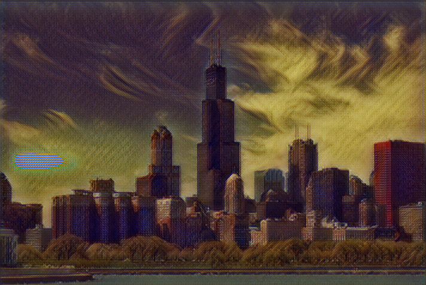

## Team members

Haoran Song, Mingjian Zhao, Jiarong Liang

## Inspiration

Want to turn your favorite photo into a stunning painting? Start, Upload and Get. Turn photos into masterpieces. Experience the era of Vincent, Leonardo da Vinci with no distance.

## What it does

Users can upload their own photos on the discord channel, select the paintings that need style transfer, and then they will get new photos that with the master's style, and the new photos will be automatically added to the emoji.

## How we built it

Using CNN neural network, for each masterwork, more than 80,000 pictures in the coco data set on the Google Colab are used for training to obtain a TensorFlow. When users upload photos and choose the style, the discord robot will stylize the photos with the corresponding model.

## Challenges we ran into

It is difficult to train a good model with a large number of images in one day. How to deploy TensorFlow models on discord is also our first contact. Fortunately, we all worked together to overcome one problem after another.

## Accomplishments that we're proud of

Neural networks may sound like a long way from our lives, but in just one day, we can make it easy for people to stylize their own photos without even having to download an app. Start, Upload and Get.

## What we learned

Teamwork is the key to success. The power of one person is very limited, but many people work together to make great things in a very short time.

## What's next for style transfer discord bot

Provide more stylization options, enrich the functions of the discord robot, and make it easier for people to process photos.

## Image Stylization
We added styles from various paintings to a photo of Chicago. Click on thumbnails to see full applied style images.

     

 

 

 

